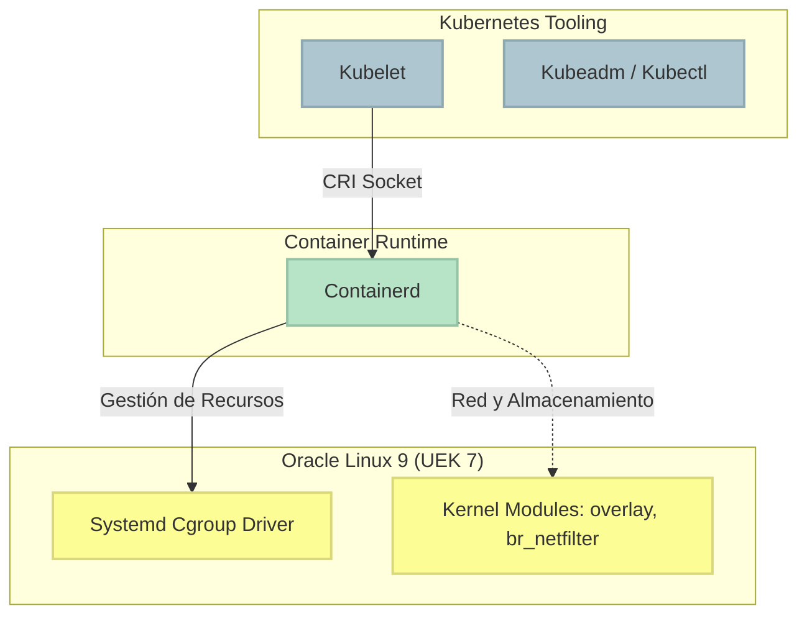

# 02 — Instalación del Runtime de Contenedores y Binarios

Ahora que tenemos nuestros servidores Oracle Linux 9.7 con UEK 7 totalmente saneados, es hora de instalar el "motor" que correrá nuestras aplicaciones, y las "herramientas" que nos permitirán construir el clúster.

> **Aplica para:** Nodos MANAGER y WORKER. (¡El HA-Proxy no necesita nada de esto!).
> **Privilegios:** Seguimos como `root`.

---

### ⚙️ Arquitectura Interna del Nodo



---

## 1. El Runtime: ¿Por qué Containerd?

Atrás quedaron los días donde Docker era el motor por defecto. Hoy en día, Kubernetes interactúa directamente con **containerd** a través de la interfaz estándar CRI (Container Runtime Interface). Es más ligero, más rápido y directamente soportado por la CNCF.

### 1.1 Configurando el Kernel para el Runtime

Los contenedores son, en el fondo, magia de Linux (cgroups y namespaces). Para que el tráfico de red pueda viajar entre los Pods y hacia el mundo exterior, el UEK 7 necesita cargar unos módulos específicos de enrutamiento.

```bash
# Definimos los módulos
cat <<EOF > /etc/modules-load.d/k8s.conf
overlay
br_netfilter
EOF

# Cargamos los módulos de inmediato
modprobe overlay
modprobe br_netfilter
```

Además, instruiremos al kernel (sysctl) para que reenvíe el tráfico IP y permita que los paquetes que cruzan bridges de red sean interceptados por `iptables`.

```bash
cat <<EOF > /etc/sysctl.d/k8s.conf
net.bridge.bridge-nf-call-iptables  = 1
net.bridge.bridge-nf-call-ip6tables = 1
net.ipv4.ip_forward                 = 1
EOF

# Le decimos a Linux que lea los cambios
sysctl --system
```

---

## 2. Instalación de Containerd

Como Oracle Linux 9 es compatible binariamente con RHEL/CentOS, usaremos el repositorio estable de Docker para obtener la versión más fresca de `containerd.io`.

```bash
dnf config-manager --add-repo https://download.docker.com/linux/centos/docker-ce.repo
dnf install -y containerd.io
```

### 2.1 El Detalle Crítico: El Cgroup Driver

Aquí es donde muchos ingenieros cometen su primer error crítico en entornos de producción. Kubernetes (a través del `kubelet`) no se comunicará con Containerd a menos que tengan el mismo "Cgroup Driver" (Systemd). Por defecto, containerd intenta usar su propio gestor nativo (`cgroupfs`). ¡No podemos tener a dos jefes dando órdenes! Debemos decirle a containerd que deje a `systemd` al mando.

```bash
# 1. Generar la configuración completa por defecto de containerd
mkdir -p /etc/containerd
containerd config default > /etc/containerd/config.toml

# 2. Reemplazar "SystemdCgroup = false" por "true"
sed -i 's/SystemdCgroup = false/SystemdCgroup = true/' /etc/containerd/config.toml

# 3. Arrancar y habilitar para que inicie en el boot
systemctl enable --now containerd
```
*Validación: Ejecuten `systemctl status containerd` y asegúrense que dice "active (running)".*

---

## 3. Instalación de las "Tres K" (kubeadm, kubelet, kubectl)

Es hora de instalar la sagrada trinidad de la administración de Kubernetes:
- **kubelet**: El "capataz" del nodo. Recibe órdenes del Master y se asegura de que containerd levante los pods asignados.
- **kubeadm**: Nuestra herramienta de bootstrap. Hará la magia pesada de generar certificados TLS, inicializar etcd y levantar el API Server.
- **kubectl**: El cliente CLI. La herramienta con la que hablarás con el clúster todos los días.

### 3.1 Añadir el Repositorio de Kubernetes
*Nota: Usaremos la versión v1.30, que es madura y estable.*

```bash
cat <<EOF > /etc/yum.repos.d/kubernetes.repo
[kubernetes]
name=Kubernetes
baseurl=https://pkgs.k8s.io/core:/stable:/v1.30/rpm/
enabled=1
gpgcheck=1
gpgkey=https://pkgs.k8s.io/core:/stable:/v1.30/rpm/repodata/repomd.xml.key
EOF
```

### 3.2 Instalación

```bash
# Deshabilitamos temporalmente cualquier exclusión que pueda impedir la instalación
dnf install -y kubelet kubeadm kubectl --disableexcludes=kubernetes

# El kubelet debe arrancar al iniciar el servidor.
# NOTA: Ahora mismo, si haces un 'systemctl status kubelet' verás que está fallando (crashlooping).
# ¡Es normal! Está esperando a que ejecutemos kubeadm init o join.
systemctl enable kubelet
```

---

## 4. Tip de Arquitectura: Fijar la IP del Nodo

Si su servidor de Oracle Linux tiene más de una interfaz de red (por ejemplo, una para administración y otra para internet), el `kubelet` a veces se "confunde" y usa la IP equivocada, cortando la comunicación del clúster.

Para evitar dolores de cabeza, obliguémosle a usar la IP interna correcta:

```bash
# IMPORTANTE: Reemplaza 192.168.1.X por la IP de TU nodo en la red interna del clúster
echo "KUBELET_EXTRA_ARGS='--node-ip=192.168.1.X'" > /etc/sysconfig/kubelet

systemctl daemon-reload
systemctl restart kubelet
```

¡Excelente trabajo! La infraestructura base ya está construida. En la siguiente sesión configuraremos nuestro balanceador de carga para asegurar la alta disponibilidad.

---

**Material Patrocinado por:** DevSecOps Group SAC (Consultoría & Entrenamiento Corporativo)  
**Instructor Certificado:** Ing. Jesús A. Chávez Becerra  
**Contacto:** jesus@devsecops.pe  
