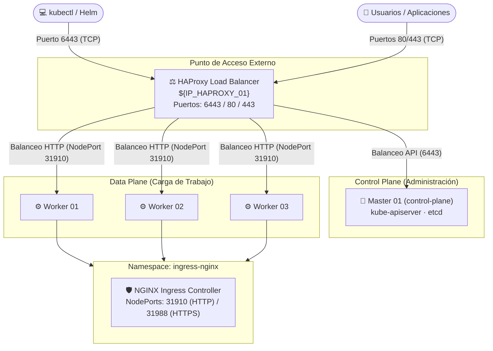

# 📖 Guía de Instalación de Kubernetes (Ambiente Pre-Productivo)

Esta guía detalla los pasos manuales para realizar el bootstrap, configuración y validación de un clúster Kubernetes altamente eficiente en un **entorno On-Premise pre-productivo**. Toda la configuración está basada en `kubeadm` y el runtime de contenedores `containerd`.

---

## 👨‍💻 Autoría y Créditos
* **Diseño y Automatización**: **Ing. Jesús A. Chávez Becerra**
* **Cargo**: *DevSecOps, Cloud and Infrastructure Architect*
* **Empresa / Firma**: **DevSecOps Group S.A.C.**
* **Recomendación de Entorno**: **Pre-Productivo (Staging / Testing / QA)**

---

## 🏗️ Arquitectura del Entorno

La topología del clúster de pre-producción consta de **1 HAProxy, 1 Control Plane y 3 Data Plane (Workers)**:



---

## 📋 Flujo de Instalación Secuencial


---

## 🛠️ Pasos de Instalación Paso a Paso

### 1. Auditoría y Validación Inicial del Entorno
Ejecute el script de validación automatizado en **todos** los servidores (HAProxy, Master y Workers) para garantizar el cumplimiento de requisitos del SO, red y dependencias:

```bash
# Otorgar permisos y ejecutar en cada nodo
chmod +x ./01-setup-k8s-pre-reqs.sh
./01-setup-k8s-pre-reqs.sh

# Cargar las variables del entorno generadas automáticamente en la sesión actual
K8S_VARIABLES="/root/k8s-installer/cluster.env"
source ${K8S_VARIABLES}
```

---

### 2. Pre-carga de Imágenes Kubernetes
Ejecute **solo en el nodo Master 01** para descargar previamente las imágenes del sistema de Kubernetes:

```bash
kubeadm config images pull --kubernetes-version ${KUBERNETES_VERSION}.0 --v=5
crictl images list
```

---

### 3. Configuración de HAProxy (Load Balancer API)
Ejecute **solo en el nodo HAProxy (Balanceador)** para configurar el reenvío del API Server:

```bash
cat > /etc/haproxy/haproxy.cfg <<EOF
global
  log /dev/log local0
  log /dev/log local1 notice
  user haproxy
  group haproxy
  daemon
  maxconn 100000

defaults
  log global
  mode tcp
  option tcplog
  option dontlognull
  timeout connect 10s
  timeout client  1h
  timeout server  1h
  timeout check   10s

frontend k8s_api
  bind 0.0.0.0:6443
  mode tcp
  option tcplog
  default_backend k8s_controlplanes

backend k8s_controlplanes
  mode tcp
  balance roundrobin
  server ${HOSTNAME_MASTER_01} ${IP_MASTER_01}:6443 check
EOF

# Validar sintaxis de la configuración
haproxy -c -f /etc/haproxy/haproxy.cfg

# Habilitar e iniciar servicio
systemctl restart haproxy
systemctl enable haproxy
systemctl status haproxy --no-pager -l

# Verificar que HAProxy escuche en el puerto 6443
ss -nltp | grep 6443
```

---

### 4. Configuración de Kubelet (`node-ip`)
Ejecute en cada nodo correspondiente para forzar el uso de la interfaz de red correcta:

```bash
# En el Master 01:
echo "KUBELET_EXTRA_ARGS='--node-ip=${IP_MASTER_01}'" > /etc/sysconfig/kubelet

# En el Worker 01:
echo "KUBELET_EXTRA_ARGS='--node-ip=${IP_WORKER_01}'" > /etc/sysconfig/kubelet

# En el Worker 02:
echo "KUBELET_EXTRA_ARGS='--node-ip=${IP_WORKER_02}'" > /etc/sysconfig/kubelet

# En el Worker 03:
echo "KUBELET_EXTRA_ARGS='--node-ip=${IP_WORKER_03}'" > /etc/sysconfig/kubelet

# Reiniciar kubelet en TODOS los nodos (Master + Workers)
sudo systemctl daemon-reload
sudo systemctl restart kubelet
systemctl status kubelet --no-pager -l
```

---

### 5. Inicialización del Control Plane (Master)
Ejecute **solo en el nodo Master 01**:

```bash
cat > /root/k8s-installer/kubeadm-config.yml <<EOF
# ---------------- INIT CONFIG ----------------
apiVersion: kubeadm.k8s.io/v1beta4
kind: InitConfiguration

localAPIEndpoint:
  advertiseAddress: "${IP_MASTER_01}"
  bindPort: 6443

nodeRegistration:
  criSocket: unix:///var/run/containerd/containerd.sock
  kubeletExtraArgs:
  - name: node-ip
    value: "${IP_MASTER_01}"
  taints:
  - effect: NoSchedule
    key: node-role.kubernetes.io/control-plane

---
# ---------------- CLUSTER CONFIG ----------------
apiVersion: kubeadm.k8s.io/v1beta4
kind: ClusterConfiguration

clusterName: kubernetes
controlPlaneEndpoint: "${IP_HAPROXY_01}:6443"
kubernetesVersion: "${KUBERNETES_VERSION}.0"

networking:
  podSubnet: "15.244.0.0/16"
  serviceSubnet: "15.96.0.0/12"

apiServer:
  certSANs:
  - "${IP_HAPROXY_01}"
  - "${IP_MASTER_01}"
  extraArgs:
  - name: default-not-ready-toleration-seconds
    value: "20"
  - name: default-unreachable-toleration-seconds
    value: "20"

controllerManager:
  extraArgs:
  - name: node-monitor-grace-period
    value: "20s"
  - name: node-monitor-period
    value: "5s"
  - name: node-startup-grace-period
    value: "30s"

---
# ---------------- KUBELET CONFIG ----------------
apiVersion: kubelet.config.k8s.io/v1beta1
kind: KubeletConfiguration

nodeStatusUpdateFrequency: 5s
nodeStatusReportFrequency: 5s
nodeLeaseDurationSeconds: 20
runtimeRequestTimeout: "15s"
evictionPressureTransitionPeriod: 30s
volumeStatsAggPeriod: 30s
hairpinMode: "hairpin-veth"
imageGCHighThresholdPercent: 70
imageGCLowThresholdPercent: 50
containerLogMaxFiles: 3
containerLogMaxSize: 50Mi
EOF

# Inicializar clúster con configuración
sudo kubeadm init --config "/root/k8s-installer/kubeadm-config.yml" --upload-certs

# Configurar kubeconfig en el usuario root
mkdir -p $HOME/.kube
sudo cp -i /etc/kubernetes/admin.conf $HOME/.kube/config
sudo chown $(id -u):$(id -g) $HOME/.kube/config
```

---

### 6. Unión de Nodos Workers (Data Plane)
Copie el comando de unión de la salida del `kubeadm init` ejecutado anteriormente y ejecútelo en **Worker 01, Worker 02 y Worker 03**:

```bash
kubeadm join ${IP_HAPROXY_01}:6443 --token <tu_token> --discovery-token-ca-cert-hash sha256:<tu_hash_ca>
```

---

### 7. Instalación del CNI (Calico)
Ejecute **solo en el Master 01** para establecer la capa de red interna del clúster:

```bash
kubectl apply -f /root/k8s-installer/yamls/calico.yaml
```

---

### 8. Validación Inicial del Clúster
Verifique que los nodos e infraestructura se encuentren saludables (el estado `Ready` puede tomar entre 3 y 5 minutos):

```bash
# Nodos del clúster
kubectl get nodes -o wide

# Pods base en ejecución
kubectl get pods -A -o wide

# Health endpoints del API Server a través del Balanceador
curl -k https://${IP_HAPROXY_01}:6443/readyz
curl -k https://${IP_HAPROXY_01}:6443/livez
```

---

### 9. Instalación de Helm CLI
Ejecute **solo en el Master 01** para habilitar la administración de paquetes de Kubernetes:

```bash
# Descargar e instalar Helm
curl -fsSL -o get_helm.sh https://raw.githubusercontent.com/helm/helm/main/scripts/get-helm-3
chmod 700 get_helm.sh
./get_helm.sh
rm -f get_helm.sh

# Configurar repositorio oficial de Ingress Nginx
helm repo add ingress-nginx https://kubernetes.github.io/ingress-nginx
helm repo update

# Validar
helm repo list
```

---

### 10. Despliegue de NGINX Ingress Controller
Ejecute **solo en el Master 01** para desplegar el controlador de ingreso oficial utilizando los NodePorts estandarizados (`31910` para HTTP y `31988` para HTTPS):

```bash
helm upgrade --install ingress-nginx ingress-nginx/ingress-nginx \
  --namespace ingress-nginx \
  --create-namespace \
  --version 4.14.3 \
  --set controller.replicaCount=3 \
  --set controller.kind=Deployment \
  --set controller.ingressClassResource.name=nginx \
  --set controller.ingressClassResource.enabled=true \
  --set controller.ingressClassResource.default=true \
  --set controller.service.type=NodePort \
  --set controller.service.externalTrafficPolicy=Cluster \
  --set controller.service.internalTrafficPolicy=Cluster \
  --set controller.service.nodePorts.http=${NGX_SVC_HTTP_NODEPORT} \
  --set controller.service.nodePorts.https=${NGX_SVC_HTTPS_NODEPORT} \
  --set controller.admissionWebhooks.enabled=true

# Habilitar guiones bajos en cabeceras HTTP (altamente recomendado en microservicios)
kubectl -n ingress-nginx patch configmap ingress-nginx-controller \
  --patch '{"data":{"enable-underscores-in-headers":"true"}}'

# Validar estado de pods de Ingress
kubectl get pods,svc -n ingress-nginx -o wide
```

---

### 11. Segunda Configuración de HAProxy (Ingress para Usuarios)
Ejecute **solo en el nodo HAProxy (Balanceador)** para enrutar el tráfico HTTP y HTTPS normal hacia el Ingress Controller de Kubernetes:

```bash
cat >> /etc/haproxy/haproxy.cfg <<EOF

frontend ingress_http
    bind 0.0.0.0:80
    mode http
    option httplog
    default_backend node-ingress-http

backend node-ingress-http
    mode http
    balance roundrobin
    server ${HOSTNAME_WORKER_01} ${IP_WORKER_01}:${NGX_SVC_HTTP_NODEPORT} check
    server ${HOSTNAME_WORKER_02} ${IP_WORKER_02}:${NGX_SVC_HTTP_NODEPORT} check
    server ${HOSTNAME_WORKER_03} ${IP_WORKER_03}:${NGX_SVC_HTTP_NODEPORT} check

frontend ingress_https
    bind 0.0.0.0:443
    mode tcp
    option tcplog
    default_backend node-ingress-https

backend node-ingress-https
    mode tcp
    balance roundrobin
    server ${HOSTNAME_WORKER_01} ${IP_WORKER_01}:${NGX_SVC_HTTPS_NODEPORT} check
    server ${HOSTNAME_WORKER_02} ${IP_WORKER_02}:${NGX_SVC_HTTPS_NODEPORT} check
    server ${HOSTNAME_WORKER_03} ${IP_WORKER_03}:${NGX_SVC_HTTPS_NODEPORT} check
EOF

# Validar y reiniciar HAProxy
haproxy -c -f /etc/haproxy/haproxy.cfg
systemctl restart haproxy
systemctl status haproxy --no-pager -l
```

---

### 12. Validación Final de Acceso
Valide que el balanceador HAProxy distribuya correctamente el tráfico web externo hacia los workers:

```bash
# Validar HTTP (Debe retornar un error 404 de Nginx, lo cual es correcto pues no hay rutas definidas)
curl http://${IP_HAPROXY_01}

# Validar HTTPS (Debe retornar 404 de Nginx y validar el handshake SSL)
curl -k https://${IP_HAPROXY_01}
```

> **¡Felicidades!** Su clúster Kubernetes HA On-Premise para entornos pre-productivos está 100% operativo, balanceado y listo para alojar cargas de trabajo del negocio de forma automatizada.

---

## 🔄 Re-instalación y Limpieza profunda de los Nodos

Si requiere rehacer el clúster desde cero o cambiar la asignación de red (IPs) en los servidores físicos, puede ejecutar el script de limpieza profunda en cada nodo. El script detectará el rol e iniciará un reset del sistema preservando los paquetes base para agilizar la reinstalación:

```bash
chmod +x /root/k8s-installer/03-teardown-servers.sh
./03-teardown-servers.sh
```

---
**Diseño e Ingeniería de Plataforma:**  
**Ing. Jesús A. Chávez Becerra** | *DevSecOps, Cloud and Infrastructure Architect*  
*DevSecOps Group S.A.C.*
