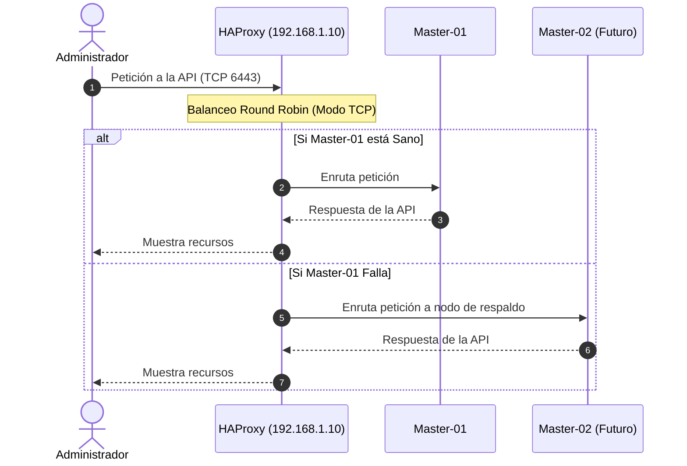

# 03 — Configuración de HAProxy: El Guardián del API Server

> **Arquitectura del Laboratorio:** 1 HA-Proxy (Balanceador) · 1 Nodo Manager (Control-Plane) · 3 Nodos Workers (Data-Plane)

¡Seguimos avanzando! Ahora vamos a entrar a un concepto que separa a los clústeres de uso no productivo de los clústeres de grado empresarial.

Cuando un clúster de Kubernetes solo tiene un nodo Control Plane (Master), ese nodo es un "Single Point of Failure" (SPOF). Si se cae, te quedas sin acceso al clúster. En el mundo real, instalamos múltiples nodos Master. Pero, ¿a qué IP debe apuntar el Worker? ¿A la del Master 1 o Master 2? 

La respuesta es: a ninguno. Apuntan a un Balanceador de Carga (HAProxy) que distribuye las peticiones. En esta lección configuraremos ese balanceador.

> **Aplica para:** SOLO al Nodo HA-Proxy (Balanceador de Carga).
> **Privilegios:** Seguimos como `root`.

---

### ⚖️ Topología de Balanceo de Carga



---

## 1. Instalación de HAProxy en Oracle Linux 9

HAProxy es rápido, altamente confiable y el estándar de la industria para proxy inverso TCP.

```bash
dnf install -y haproxy
systemctl enable --now haproxy
```

---

## 2. Configurando el Balanceo (Puerto 6443)

El **kube-apiserver** es la "puerta de entrada" al cerebro de Kubernetes y por defecto escucha tráfico cifrado TCP en el puerto `6443`. Vamos a decirle al HAProxy que se pare en la puerta, reciba todo el tráfico en el `6443` y lo mande al Master.

```bash
# Como buena práctica de sysadmin, hagamos backup antes de romper nada.
cp /etc/haproxy/haproxy.cfg /etc/haproxy/haproxy.cfg.bak

# Escribamos la configuración nueva
cat > /etc/haproxy/haproxy.cfg <<EOF
global
  log /dev/log local0
  log /dev/log local1 notice
  user haproxy
  group haproxy
  daemon
  maxconn 100000

defaults
  log global
  mode tcp
  option tcplog
  option dontlognull
  timeout connect 10s
  timeout client  1h
  timeout server  1h
  timeout check   10s

# El FRONTEND es el puerto de escucha en el balanceador
frontend k8s_api
  bind 0.0.0.0:6443
  mode tcp
  option tcplog
  default_backend k8s_controlplanes

# El BACKEND son los nodos destino
backend k8s_controlplanes
  mode tcp
  balance roundrobin
  
  # === CONFIGURA TUS MASTERS AQUÍ ===
  # Reemplaza 192.168.1.20 por la IP de tu Master
  server master-01 192.168.1.20:6443 check
  
  # Si en el futuro añades un master-02, lo pones aquí abajo:
  # server master-02 192.168.1.21:6443 check
EOF
```

---

## 3. Validación y Puesta en Marcha

Una regla de oro antes de reiniciar cualquier servicio en Linux: **Verifica siempre la sintaxis**.

```bash
# Validar
haproxy -c -f /etc/haproxy/haproxy.cfg

# Si responde "Configuration file is valid", apliquen los cambios:
systemctl restart haproxy
```

### 3.1 Comprobación Final

Asegúrense de que HAProxy abrió el puerto con éxito.

```bash
ss -nltp | grep 6443
```
Deben visualizar que el proceso `haproxy` está bindeado a `*:6443` o `0.0.0.0:6443`.

> [!TIP]
> **Reflexión del Instructor**
> En el siguiente paso, cuando hagamos el famoso `kubeadm init` en el Master, le diremos: *"Oye, el Endpoint principal del clúster NO es tu IP local, es la IP de este servidor HAProxy"*. Así es como cimentamos la arquitectura de Alta Disponibilidad (HA).

---

> **Siguiente paso:** [Laboratorio 04: Inicialización del Clúster (Control Plane)](./04-inicializacion-manager.md) — Encenderemos el cerebro del clúster.

---

**Material Patrocinado por:** DevSecOps Group SAC (Consultoría & Entrenamiento Corporativo)  
**Instructor Certificado:** Ing. Jesús A. Chávez Becerra  
**Contacto:** jesus@devsecops.pe  
