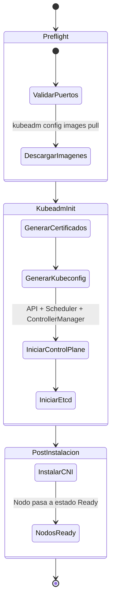

# 04 — Inicialización del Clúster (Control Plane / Manager)

¡Llegó el momento de la verdad! En esta sesión vamos a encender el cerebro de nuestro clúster. Como administrador de la plataforma, el nodo Manager es tu templo. Aquí vivirá el `kube-apiserver`, `etcd`, el `controller-manager` y el `scheduler`. 

> **Aplica para:** Nodo MANAGER (Ej. master-01).
> **Privilegios:** Root (`sudo su -`).

---

### 🚀 Secuencia de Inicialización (Bootstrap)



---

## 1. El Pre-pull: Evitando fallos por timeout

Docker Hub tiene límites de tasa de descarga (Rate Limits) muy agresivos para usuarios anónimos. Si `kubeadm` se demora mucho bajando imágenes durante la inicialización, la instalación arrojará un "timeout" y fallará.

Como profesionales, siempre precargamos las imágenes necesarias.

```bash
# Cambia la versión por la que estés usando (ej. v1.30.0)
kubeadm config images pull --kubernetes-version v1.30.0
```
*Si ves que se descarga todo correctamente, es un gran alivio y validamos que el nodo tiene salida a internet.*

---

## 2. El Arte de `kubeadm init` Declarativo

Existen dos formas de iniciar un clúster: mediante un comando largo en la terminal, o usando un archivo YAML.
En el examen de certificación (CKA) y en entornos Enterprise, **siempre usamos la forma declarativa** porque es auditable y versionable.

Creen el archivo `kubeadm-config.yml`:

```bash
cat <<EOF > kubeadm-config.yml
apiVersion: kubeadm.k8s.io/v1beta3
kind: InitConfiguration
localAPIEndpoint:
  # IP REAL de ESTE nodo master
  advertiseAddress: "192.168.1.20"
  bindPort: 6443
nodeRegistration:
  criSocket: unix:///var/run/containerd/containerd.sock
  kubeletExtraArgs:
    node-ip: "192.168.1.20"
---
apiVersion: kubeadm.k8s.io/v1beta3
kind: ClusterConfiguration
clusterName: kubernetes
# IMPORTANTE: ¡Aquí entra en juego el balanceador que configuramos antes!
# Esta es la IP del nodo HAProxy
controlPlaneEndpoint: "192.168.1.10:6443"
kubernetesVersion: "v1.30.0"
networking:
  # Rango de IPs reservado para los Pods (Debe coincidir con la config del CNI Calico)
  podSubnet: "15.244.0.0/16"
  # Rango de IPs reservado para los Services
  serviceSubnet: "15.96.0.0/12"
apiServer:
  certSANs:
  - "192.168.1.10" # IP del Balanceador
  - "192.168.1.20" # IP de este nodo
EOF
```
*(No olviden ajustar las IPs `192.168.1.20` a su Master y `192.168.1.10` a su Balanceador).*

Ejecutemos la inicialización:

```bash
kubeadm init --config kubeadm-config.yml --upload-certs
```

> [!CAUTION]
> Cuando el comando termine, **guarda como oro el comando `kubeadm join` que aparece al final**. Lo usarás para unir los Workers en la próxima lección.

---

## 3. Concediendo acceso administrativo (Kubeconfig)

El clúster está vivo, pero si ejecutas `kubectl get nodes` te dirá "connection refused". Esto es porque no tienes las credenciales (el archivo kubeconfig). Vamos a copiarlas a nuestro perfil de usuario.

```bash
mkdir -p $HOME/.kube
cp -i /etc/kubernetes/admin.conf $HOME/.kube/config
chown $(id -u):$(id -g) $HOME/.kube/config

# Ahora sí:
kubectl get nodes
```
Si el estado es `NotReady`, respiren tranquilos. ¡Es exactamente lo esperado! El clúster sabe que le falta la pieza clave: la red.

---

## 4. El CNI: Instalando Calico

En Kubernetes, la red de los Pods no viene "out of the box". Debes instalar un plugin CNI (Container Network Interface). Hoy instalaremos **Calico**, que es líder en la industria y soporta políticas de red avanzadas.

```bash
# Navega a la carpeta del repositorio donde clonaste/descargaste los archivos
# y aplica el manifiesto de Calico específicamente validado para esta versión:
kubectl apply -f yamls/calico.yaml

# Vigilen la magia en vivo (Presionen Ctrl+C para salir)
kubectl get pods -n kube-system -w
```

Una vez que todos los pods de Calico (`calico-node`, `calico-kube-controllers`) pasen a estado `Running`, tu Master estará listo:

```bash
kubectl get nodes
```
¡Boom! El estado `Ready` es su confirmación de que todo salió perfecto. Tomen un descanso y prepárense para unir a los Workers.

---

**Material Patrocinado por:** DevSecOps Group SAC (Consultoría & Entrenamiento Corporativo)  
**Instructor Certificado:** Ing. Jesús A. Chávez Becerra  
**Contacto:** jesus@devsecops.pe  
