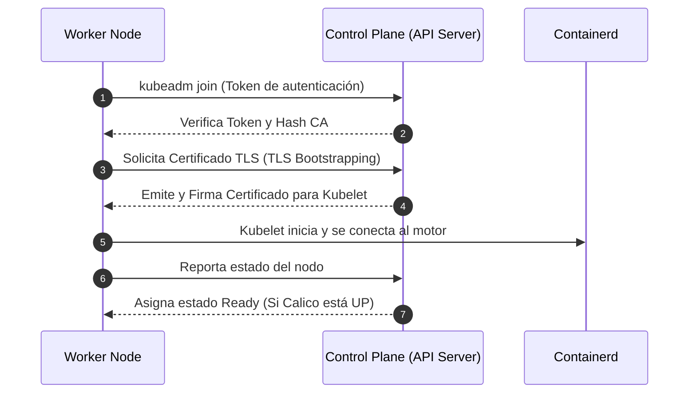

# 05 — Unión de Workers al Clúster (Data Plane)

El Master que configuramos en la lección anterior es el cerebro, pero no está diseñado para correr las aplicaciones pesadas. Para eso necesitamos la fuerza bruta: los nodos Worker (el Data Plane). En este módulo, uniremos esos nodos al clúster.

> **Aplica para:** Nodos WORKER (`worker-01`, `worker-02`, etc).
> **Privilegios:** Root (`sudo su -`).

---

### 🤝 Proceso de Unión al Clúster



---

## 1. El comando mágico: `kubeadm join`

Durante la inicialización del Master, la terminal les regaló un comando extenso. Ese comando contiene la IP del punto de entrada, un token de autenticación (válido por 24 horas) y el hash del certificado CA del clúster (para evitar ataques de hombre en el medio).

### 1.1 Uniendo la fuerza de trabajo
Tomen ese comando y péguenlo tal cual en la terminal de cada nodo Worker.

```bash
# Ejemplo visual (¡NO LO COPIES! Usa el que generó TU Master):
kubeadm join 192.168.1.10:6443 --token abcdef.0123456789abcdef --discovery-token-ca-cert-hash sha256:1234abcd...
```

¿Qué hace esto por detrás?
1. Se conecta al API Server (a través de nuestro HAProxy).
2. Valida los certificados.
3. El `kubelet` de este nodo se registra formalmente en el inventario.
4. El Master empieza a enviarle los "Pods de sistema" (como `kube-proxy` y `calico-node`) para que se sume a la red.

> [!TIP]
> **"Perdí el token, ¿ahora qué hago?"**
> Tranquilos, pasa todos los días en la vida real. Si tu token caducó o lo perdiste, ve al **nodo Master** y corre:
> ```bash
> kubeadm token create --print-join-command
> ```
> ¡Problema resuelto! Tendrás un comando nuevecito listo para usar.

---

## 2. Validar la flota

No hay nada más satisfactorio que ver a tus nodos reportándose listos para la acción. Vuelvan a la consola de su nodo **Manager** y pregunten al clúster:

```bash
# Ejecutar EN EL MANAGER:
kubectl get nodes -o wide
```

Esperen unos segundos a que Calico instale sus rutas en los nuevos nodos. Una vez completada la propagación, el clúster mostrará todos los nodos en estado `Ready`:

```text
NAME         STATUS   ROLES           AGE     VERSION    INTERNAL-IP    
master-01    Ready    control-plane   10m     v1.36.0    192.168.1.20   
worker-01    Ready    <none>          2m      v1.36.0    192.168.1.31   
worker-02    Ready    <none>          1m      v1.36.0    192.168.1.32   
worker-03    Ready    <none>          45s     v1.36.0    192.168.1.33   
```

**¡Felicidades!** Tienen un clúster distribuido en Oracle Linux funcionando impecablemente. Solo nos queda una pieza para que los clientes puedan consumir nuestras aplicaciones web, y de eso trata la siguiente y última lección.

---

**Material Patrocinado por:** DevSecOps Group SAC (Consultoría & Entrenamiento Corporativo)  
**Instructor Certificado:** Ing. Jesús A. Chávez Becerra  
**Contacto:** jesus@devsecops.pe  
