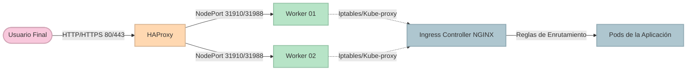

# 06 — Despliegue del Ingress Controller y Exposición Externa

¡Llegamos a la meta final del laboratorio! Nuestro clúster está sano y funcional, pero por defecto, Kubernetes es como una fortaleza amurallada: todo está protegido y no permite tráfico HTTP/HTTPS desde el exterior hacia tus Pods.

Para abrir las puertas del castillo de forma segura e inteligente, usaremos un **Ingress Controller** (en este caso, NGINX).

> **Aplica para:** Nodo MANAGER (para ejecutar Helm) y Nodo HA-PROXY (para el enrutamiento final).
> **Privilegios:** Root (`sudo su -`).

---

### 🌐 Flujo de Tráfico Externo (Ingress)



---

## 1. El Gestor de Paquetes: Helm

En el mundo real, no solemos instalar aplicaciones de infraestructura escribiendo YAMLs a mano desde cero; usamos "plantillas" parametrizables. Helm es precisamente el gestor de paquetes de K8s.

**En tu nodo MANAGER**, instala Helm:

```bash
# Descargar e instalar Helm
curl -fsSL -o get_helm.sh https://raw.githubusercontent.com/helm/helm/main/scripts/get-helm-3
chmod 700 get_helm.sh
./get_helm.sh
rm -f get_helm.sh

# Añadir el repositorio oficial del proyecto Ingress NGINX
helm repo add ingress-nginx https://kubernetes.github.io/ingress-nginx
helm repo update
```

---

## 2. Despliegue del Ingress NGINX en K8s

Al instalar el Ingress en un entorno On-Premise sin un "Cloud Load Balancer" nativo (como AWS ELB), la estrategia más robusta es usar el tipo `NodePort`. 
Esto obligará a **todos los Workers** a abrir puertos físicos altos (por ejemplo, el 31910 para HTTP y 31988 para HTTPS).

Ejecuten esto en el **MANAGER**:

```bash
helm upgrade --install ingress-nginx ingress-nginx/ingress-nginx \
  --namespace ingress-nginx \
  --create-namespace \
  --version 4.15.1 \
  --set controller.replicaCount=3 \
  --set controller.kind=Deployment \
  --set controller.ingressClassResource.name=nginx \
  --set controller.ingressClassResource.enabled=true \
  --set controller.ingressClassResource.default=true \
  --set controller.service.type=NodePort \
  --set controller.service.externalTrafficPolicy=Cluster \
  --set controller.service.internalTrafficPolicy=Cluster \
  --set controller.service.nodePorts.http=31910 \
  --set controller.service.nodePorts.https=31988 \
  --set controller.admissionWebhooks.enabled=true

# Validación de los pods del Ingress
kubectl get pods,svc -n ingress-nginx -o wide
```
Deberían ver pods corriendo. ¡Excelente! Pero no esperarán que sus clientes entren escribiendo un puerto extraño como `http://misitio.com:31910`, ¿verdad?

---

## 3. Cerrando el círculo con HAProxy

Aquí entra la magia de nuestro balanceador. Le diremos a HAProxy que reciba el tráfico web estándar (80 y 443) y lo envíe silenciosamente a los puertos `NodePort` de nuestros Workers.

**Ve a tu nodo HA-PROXY** y abre la configuración:

```bash
vim /etc/haproxy/haproxy.cfg
```

Añadan esto al **final** del archivo. *(Ojo, reemplacen las IPs por las de sus Workers)*:

```text
# --- TRAFICO HTTP (Puerto 80) ---
frontend ingress_http
    bind 0.0.0.0:80
    mode http
    option httplog
    default_backend node-ingress-http

backend node-ingress-http
    mode http
    balance roundrobin
    server worker-01 192.168.1.31:31910 check
    server worker-02 192.168.1.32:31910 check
    server worker-03 192.168.1.33:31910 check

# --- TRAFICO HTTPS (Puerto 443) ---
frontend ingress_https
    bind 0.0.0.0:443
    mode tcp
    option tcplog
    default_backend node-ingress-https

backend node-ingress-https
    mode tcp
    balance roundrobin
    server worker-01 192.168.1.31:31988 check
    server worker-02 192.168.1.32:31988 check
    server worker-03 192.168.1.33:31988 check
```

Guarden, validen y reinicien:
```bash
haproxy -c -f /etc/haproxy/haproxy.cfg
systemctl restart haproxy
```

---

## 4. Prueba de Fuego

Hagamos una petición al punto de entrada único: la IP del HAProxy.

```bash
curl http://192.168.1.10
```

Si ven un error HTML que dice **404 Not Found** proporcionado por "nginx", **¡HAY MOTIVO PARA CELEBRAR!** 
Significa que:
1. HAProxy atrapó la petición en el puerto 80.
2. HAProxy eligió a un Worker sano.
3. El Worker lo pasó por el NodePort 31910 hacia el clúster.
4. El Ingress Controller de NGINX respondió. (Da error 404 simplemente porque aún no has desplegado ninguna App para enrutar).

> [!IMPORTANT]
> **Fin del Laboratorio**
> Felicidades, han logrado instalar y operar un clúster Kubernetes desde cero, dominando cada componente interno a nivel de arquitectura: desde Linux, pasando por Containerd, hasta el CNI y el Ingress. Han consolidado habilidades críticas de infraestructura moderna. ¡Éxitos en producción!

---

**Material Patrocinado por:** DevSecOps Group SAC (Consultoría & Entrenamiento Corporativo)  
**Instructor Certificado:** Ing. Jesús A. Chávez Becerra  
**Contacto:** jesus@devsecops.pe
