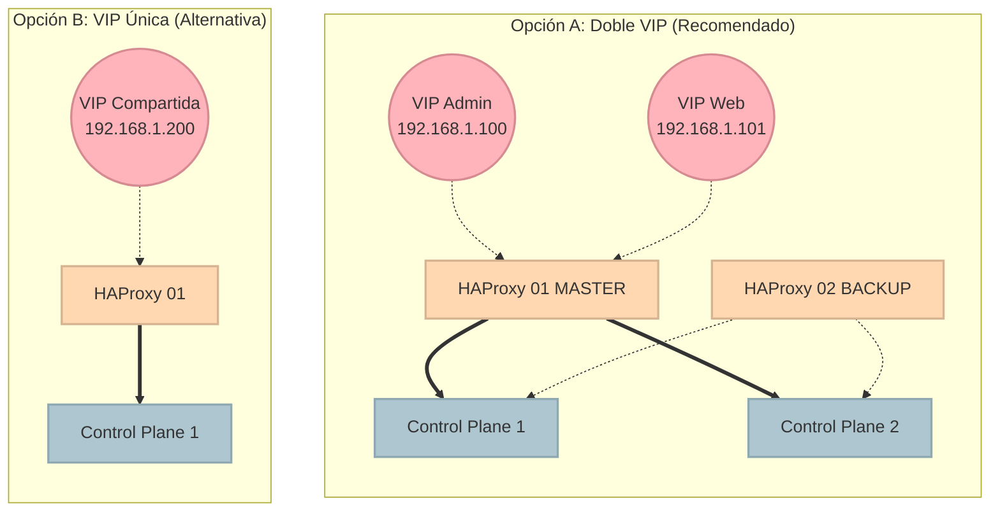

# 07 — Operación y Troubleshooting: Manteniendo el Clúster Vivo

> **Arquitectura del Laboratorio:** 1 HA-Proxy (Balanceador) · 1 Nodo Manager (Control-Plane) · 3 Nodos Workers (Data-Plane)

Como arquitectos de plataformas Cloud Native, instalar Kubernetes es solo el 20% del trabajo. El verdadero reto es mantenerlo operando, diagnosticar problemas y saber qué hacer cuando "todo se rompe".

En esta guía final, cubriremos los escenarios más comunes de operación.

> **Aplica para:** Nodo Manager (Control-Plane) y Nodos Workers (Data-Plane), dependiendo del incidente.
> **Privilegios:** Root (`sudo su -`).

---

## 1. Health Check Básico del Clúster

Antes de entrar en pánico cuando una aplicación falla, siempre validen la salud base de la infraestructura:

```bash
# ¿Están todos los nodos reportando como "Ready"?
kubectl get nodes -o wide

# ¿Hay algún pod del sistema reiniciándose constantemente (CrashLoopBackOff)?
kubectl get pods -A -o wide | grep -v Running
```

---

## 2. Validación de HAProxy

Si de repente reciben errores "Connection Refused" al usar `kubectl` o la API no responde, el primer sospechoso es el balanceador de carga.

**En el nodo HAProxy:**
```bash
# Validar estado del servicio
systemctl status haproxy --no-pager -l

# Ver puertos de escucha (Debe estar el puerto 6443)
ss -nltp | egrep ':6443|:80|:443'
```

---

## 3. Redeploy de Aplicaciones (Rollout)

Cuando hacemos cambios manuales (por ejemplo, editar un ConfigMap) y queremos que los pods tomen la nueva configuración, no los borramos manualmente. Usamos `rollout restart`.

```bash
# Ejemplo: Reiniciar los pods del Ingress NGINX para forzar recarga
kubectl -n ingress-nginx rollout restart deployment
kubectl -n ingress-nginx rollout status deployment
```

---

## 4. Mantenimiento: Drain de Nodos

Si necesitan apagar un Worker (para agregarle RAM, parchar el OS, etc.), NUNCA lo apaguen de golpe. Sigan el protocolo:

```bash
# 1. CORDON: Marca el nodo como "Unschedulable" (No acepta pods nuevos)
kubectl cordon worker-01

# 2. DRAIN: Expulsa todos los pods vivos hacia otros nodos sanos
kubectl drain worker-01 --ignore-daemonsets --delete-emptydir-data --force
```
*Cuando el mantenimiento termine, devuelvan el nodo a la granja con `kubectl uncordon worker-01`.*

---

## 5. El Botón de Pánico: Reset Manual de un Nodo

Si configuraron algo mal durante los laboratorios o un nodo quedó en un estado irrecuperable, **no reinstalen el sistema operativo**. A continuación les presento el protocolo exacto para purgar cualquier rastro de Kubernetes y empezar desde cero.

**Ejecutar en el nodo afectado:**

```bash
# 1. Desarmar el nodo (Borra certificados, etcd local y detiene contenedores)
kubeadm reset -f

# 2. Purgar directorios residuales del CNI y Kubelet
rm -rf \
  /etc/cni \
  /etc/kubernetes \
  /var/lib/etcd \
  /var/lib/kubelet \
  /var/run/kubernetes \
  ~/.kube/*

# 3. Limpiar las reglas de red cacheadas en el kernel
iptables -F && iptables -X
iptables -t nat -F && iptables -t nat -X
iptables -t raw -F && iptables -t raw -X
iptables -t mangle -F && iptables -t mangle -X

# 4. Reiniciar los servicios base para que arranquen limpios
systemctl daemon-reload
systemctl restart containerd
systemctl restart kubelet
```

Después de esto, el nodo está limpio y listo para recibir nuevamente un comando `kubeadm init` o `kubeadm join`.

---

## 6. Caso Atípico: Migración de Datacenter o Cambio de IPs (Teardown Completo)

Como arquitectos, a veces nos enfrentamos a situaciones anormales: el cliente cambia el direccionamiento IP de la empresa, o migramos las máquinas virtuales a otro Datacenter o Hipervisor. En este caso, Kubernetes se romperá porque sus certificados internos y la configuración de `etcd` están atados a las IPs originales.

Para solucionar esto **sin formatear los servidores**, debemos hacer un Teardown completo de la red y el clúster.

> [!CAUTION]
> Esto borrará toda la configuración del clúster, pero preservará sus binarios y contenedores descargados.

### Paso 1: Limpieza de Cargas de Trabajo (En el Manager)
Antes de apagar la red, limpiamos ordenadamente las aplicaciones y los volúmenes para no dejar archivos residuales atascados.

```bash
# 1. Desinstalar Helm releases
helm uninstall ingress-nginx -n ingress-nginx

# 2. Borrar todos los namespaces gestionados (esto borrará Pods y PVCs)
kubectl delete namespace ingress-nginx --grace-period=10

# 3. Eliminar los Volúmenes Persistentes residuales
kubectl delete pv --all
```

### Paso 2: Limpieza de Red de Balanceo (En el HAProxy)
Debemos desvincular las IPs antiguas de las interfaces de red del proxy.

```bash
# Detener HAProxy
systemctl stop haproxy

# Limpiar las IPs virtuales asignadas a la interfaz (Reemplaza por la interfaz real, ej. eth0)
ip addr del VIRTUAL_IP_K8S/24 dev eth0 2>/dev/null || true
```

### Paso 3: Limpieza del Kernel y Kubernetes (En Managers y Workers)
Finalmente, ejecutamos el protocolo de limpieza profunda en cada máquina tal como se explica en el paso `5. El Botón de Pánico`.

¡Listo! Sus servidores están vírgenes a nivel lógico. Ahora simplemente actualicen su `/etc/hosts` con las nuevas IPs del nuevo datacenter y sigan las guías del paso `01` al `06` para volver a levantar el clúster.

---

## 7. Arquitectura HA: Doble VIP vs VIP Única

A modo de teoría arquitectónica, cuando escalen esto a producción usarán Keepalived para crear IPs Virtuales (VIP). Tienen dos caminos de diseño:



> [!IMPORTANT]
> **Doble VIP: Solo para Entornos de Producción**
> La arquitectura de Doble VIP está diseñada exclusivamente para entornos de producción con alta criticidad. Implica la gestión de dos instancias de HAProxy con Keepalived, lo que añade complejidad operativa. Para ambientes de laboratorio, staging o desarrollo, la **Opción B (VIP Única)** es perfectamente válida y más sencilla de mantener.

**¿Por qué preferir Doble VIP en Producción?**
1. Permite aplicar reglas de Firewall estrictas a la VIP de Administración, aislando el plano de control del tráfico de usuarios.
2. Si reciben un ataque DDoS en la VIP Web, su plano de control (VIP 6443) sigue funcionando de forma aislada para que puedan entrar a mitigar el problema sin interrumpir la gestión del clúster.

---

**Material Patrocinado por:** DevSecOps Group SAC (Consultoría & Entrenamiento Corporativo)  
**Instructor Certificado:** Ing. Jesús A. Chávez Becerra  
**Contacto:** jesus@devsecops.pe  
