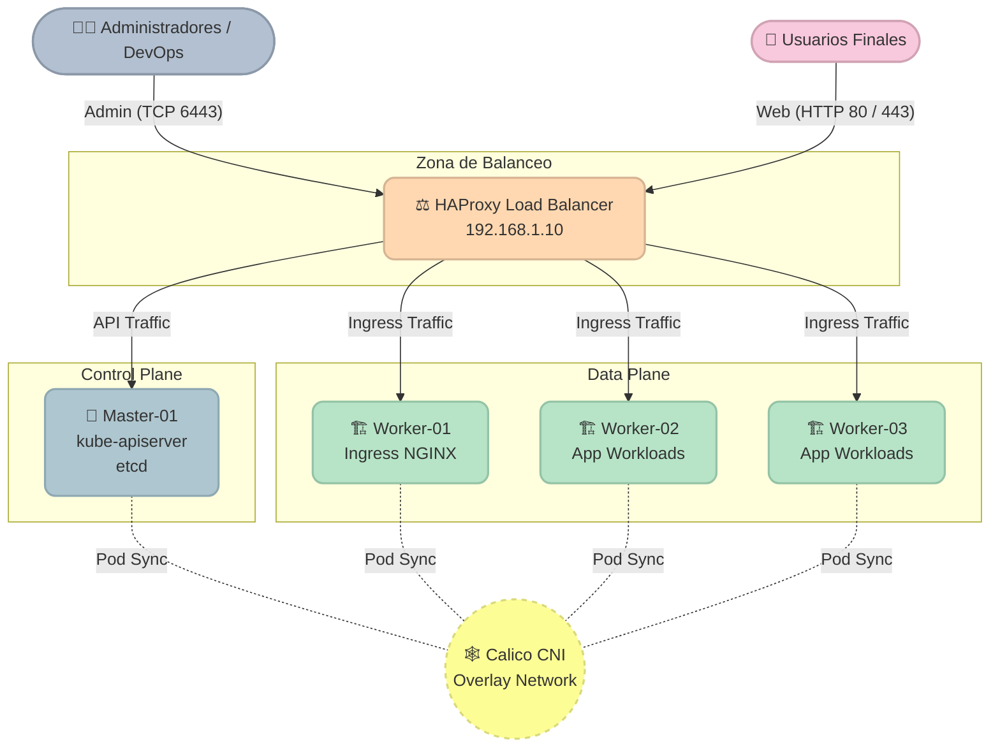

# 🚀 On-Premise Kubernetes HA Installer (Educative Edition)

¡Bienvenido a este repositorio! Si estás aquí, es porque has decidido dar el siguiente paso en tu carrera profesional y aprender cómo se construye realmente la infraestructura Cloud Native en el mundo corporativo.

## Acerca de esta Instalación

Este laboratorio documenta una **instalación estándar** de Kubernetes On-Premise (**ambiente de laboratorio**).

La arquitectura está compuesta por:

| Componente | Cantidad | Rol |
|---|---|---|
| **HA-Proxy** | 1 | Balanceador de Carga (punto de entrada único) |
| **Nodo Manager** | 1 | Control-Plane (kube-apiserver, etcd, scheduler) |
| **Nodos Workers** | 3 | Data-Plane (workloads, Ingress, aplicaciones) |

> Esta configuración es ideal para laboratorios, validaciones y ambientes de desarrollo/prueba. Para producción, se recomienda revisar la sección de alta disponibilidad con Keepalived.

Este proyecto ha sido diseñado con un **enfoque arquitectónico y formativo avanzado**. A diferencia de las guías tradicionales que te entregan un script opaco que hace todo mágicamente, aquí encontrarás el **paso a paso detallado, manual y explicado** de cada configuración requerida para levantar un clúster de **Kubernetes de alta disponibilidad en entornos On-Premise** desde cero.

---

## 🗺️ Tu Mapa de Aprendizaje: ¿Por dónde empiezo?

Si en algún momento te sientes perdido o no sabes qué archivo ejecutar a continuación, **siempre regresa a este README**. 
La instalación ha sido dividida en 6 laboratorios lógicos. Para asegurar el éxito de tu clúster, **debes seguir estrictamente este orden**:

> [!TIP]
> **El Orden de Ejecución Oficial**
> 
> 1. 🟢 **[01-preparacion-sistema-operativo.md](./01-preparacion-sistema-operativo.md)**
>    * **¿Qué haremos?** Apagar Swap, SELinux y preparar la red base.
>    * **¿Dónde?** En TODOS tus servidores.
> 
> 2. 🟢 **[02-instalacion-containerd-k8s.md](./02-instalacion-containerd-k8s.md)**
>    * **¿Qué haremos?** Instalar el motor `containerd` y las herramientas `kubeadm`, `kubelet` y `kubectl`.
>    * **¿Dónde?** En tus Managers y Workers.
> 
> 3. 🟡 **[03-configuracion-haproxy.md](./03-configuracion-haproxy.md)**
>    * **¿Qué haremos?** Configurar el punto de entrada (Balanceador) para la Alta Disponibilidad.
>    * **¿Dónde?** Únicamente en tu servidor HAProxy.
> 
> 4. 🔴 **[04-inicializacion-manager.md](./04-inicializacion-manager.md)**
>    * **¿Qué haremos?** Encender el cerebro del clúster con `kubeadm init` e instalar la red Calico.
>    * **¿Dónde?** Únicamente en tu Manager.
> 
> 5. 🔵 **[05-union-workers.md](./05-union-workers.md)**
>    * **¿Qué haremos?** Agregar fuerza de cómputo uniendo los nodos con `kubeadm join`.
>    * **¿Dónde?** En tus Workers.
> 
> 6. 🟣 **[06-despliegue-ingress.md](./06-despliegue-ingress.md)**
>    * **¿Qué haremos?** Instalar NGINX Ingress para que el mundo pueda ver tus aplicaciones.
>    * **¿Dónde?** En el Manager (para lanzar los comandos) y el HAProxy (para enrutar el puerto 80/443).

---

## 🏛️ La Arquitectura que vas a Construir

Para que no pierdas de vista el objetivo, este es el diseño lógico de lo que vas a ensamblar pieza por pieza:

---

## 🖥️ Requisitos del Laboratorio (Dimensionamiento)

Para replicar con exactitud este entorno y evitar fallos por falta de recursos, nos basaremos en el siguiente stack:

* **Sistema Operativo Base:** Oracle Linux 9.7
* **Kernel:** Unbreakable Enterprise Kernel Release 7 (UEK 7)
* **Versión de Kubernetes:** v1.36.0
* **Container Runtime:** Containerd (CRI-O compatible)

### Dimensionamiento Recomendado

| Rol | CPU (Mínimo) | RAM (Mínimo) | Almacenamiento |
|---|---|---|---|
| **HA-Proxy (Balanceador de Carga)** | 2 vCPU | 2 GB | 40 GB |
| **Nodo Manager (Control-Plane)** | 2 vCPU | 4 GB | 60 GB |
| **Nodo Worker (Data-Plane)** | 4 vCPU | 8 GB | 80 GB+ |

---

## 🚑 ¿Algo falló o te perdiste?

En la vida real, los comandos fallan por errores de tipeo, desconexiones o problemas de red. 

Si te quedas atascado o algún paso falla, **NO intentes solucionarlo copiando comandos al azar de internet**, ya que corromperás el estado del servidor. En su lugar, dirígete a tu salvavidas:

👉 **[07-ops-troubleshooting.md](./07-ops-troubleshooting.md)**

Allí encontrarás la guía de operaciones, comandos de diagnóstico y el **protocolo de reseteo manual**, que te enseñará a limpiar el servidor problemático para que puedas intentarlo de nuevo desde cero.

---

> **¿Listo para empezar?** Comienza con el [Laboratorio 01: Preparación del Sistema Operativo](./01-preparacion-sistema-operativo.md) y sigue el orden de ejecución para completar tu clúster.

---

**Material Patrocinado por:** DevSecOps Group SAC (Consultoría & Entrenamiento Corporativo)  
**Instructor Certificado:** Ing. Jesús A. Chávez Becerra  
**Contacto:** jesus@devsecops.pe
