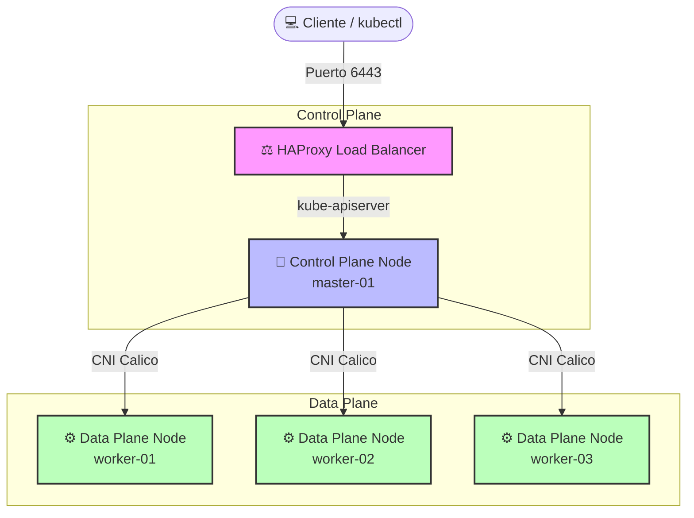

# ☸️ On-Premise Kubernetes HA Installer (Pre-Production Edition)

¡Bienvenido a este repositorio! Este proyecto ha sido diseñado con mucho esfuerzo y dedicación como un **regalo para la comunidad de TI y DevSecOps**, ofreciendo una base de conocimiento sólida, estructurada y altamente eficiente para la instalación y operación de clústeres de **Kubernetes de alta disponibilidad en entornos On-Premise** desde cero.

Esta caja de herramientas elimina la complejidad operativa de preparar sistemas operativos empresariales y proporciona un camino claro, seguro e idéntico para establecer su infraestructura de contenedores.

---

## 👨‍💻 Autoría y Créditos Profesionales

Todo el diseño arquitectónico, los scripts de cumplimiento automatizados, la guía técnica y los manuales operativos han sido concebidos y desarrollados por:

* **Autor**: **Ing. Jesús A. Chávez Becerra**
* **Cargo**: *DevSecOps, Cloud and Infrastructure Architect*
* **Empresa / Firma**: **DevSecOps Group S.A.C.**
* **Propósito**: Estandarizar despliegues de alto rendimiento y robustez en entornos reales On-Premise (especialmente sobre Oracle Linux y RHEL 8/9).

---

## ⚠️ Aclaración y Recomendación de Entorno

> [!IMPORTANT]
> **Recomendación de Entorno: PRE-PRODUCTIVO (Staging / Testing)**
> 
> Toda la arquitectura, los parámetros de optimización del Kernel, las configuraciones del balanceador de carga y las topologías de nodos aquí expuestas están **diseñadas y recomendadas específicamente para ambientes Pre-Productivos, Staging, Desarrollo y Pruebas**. 
> 
> Esta topología ofrece un balance extraordinario entre simplicidad de despliegue, eficiencia de recursos físicos y robustez para validación de aplicaciones, sin incurrir en la sobrecarga y costo que demanda un entorno de producción altamente tolerante a fallos multisitio.

---

## 🏗️ Arquitectura del Clúster

La topología de referencia recomendada para este entorno pre-productivo consta de **5 servidores independientes**:



### Detalle de Servidores:
1. **1 HAProxy (Balanceador de Carga)**: Se encarga de recibir el tráfico de administración del API Server de Kubernetes en el puerto `6443` y distribuirlo eficientemente al nodo Control Plane. También puede configurarse para balancear tráfico web (puertos `80` y `443`) hacia los NodesPorts de Ingress en el Data Plane.
2. **1 Control Plane (Master)**: Aloja los componentes esenciales de administración del clúster (`etcd`, `kube-apiserver`, `kube-scheduler`, `kube-controller-manager`).
3. **3 Data Plane (Workers)**: Nodos dedicados exclusivamente a la ejecución de sus cargas de trabajo (Pods), garantizando la correcta distribución y alta disponibilidad de las aplicaciones mediante el CNI.

---

## 🗂️ Estructura del Repositorio

El repositorio se ha organizado con una secuencia numérica lógica, limpia y auto-explicativa para guiar al ingeniero paso a paso:

```text
k8s_installers/
├── README.md                     # Bienvenida, arquitectura y créditos del repositorio
├── 01-setup-k8s-pre-reqs.sh      # Script de cumplimiento de prerrequisitos del SO y red
├── 02-k8s-installation-guide.md  # Guía manual paso a paso del bootstrap del clúster hasta Helm/Ingress
├── 03-teardown-servers.sh        # Script automatizado de limpieza profunda y reset del servidor
├── 04-ops-troubleshooting.md     # Manual detallado de operaciones, monitoreo y troubleshooting de K8s
└── yamls/
    ├── calico.yaml               # Manifiesto de red Calico CNI (v3.27+)
    └── local-path-storage.yaml   # Provisionador de almacenamiento local de referencia
```

---

## 🚀 Secuencia de Despliegue Técnica

Para lograr una instalación 100% exitosa, siga estrictamente el siguiente flujo:

### Paso 1: Preparación Automatizada (`01-setup-k8s-pre-reqs.sh`)
Ejecute este robusto script en **cada uno de los 5 servidores**. El script analizará automáticamente el sistema operativo (Oracle Linux o RHEL 8/9), comprobará compatibilidad de CPU, RAM, red, repositorios, desactivará Firewalld/SELinux de forma permanente, configurará parámetros avanzados del kernel (`sysctl`), deshabilitará swap y preparará los binarios e inventario comunes para el clúster.
```bash
# Otorgar permisos y ejecutar
chmod +x ./01-setup-k8s-pre-reqs.sh
./01-setup-k8s-pre-reqs.sh
```

### Paso 2: Instalación del Clúster (`02-k8s-installation-guide.md`)
Siga detalladamente la guía de instalación manual. Esta le guiará a través de:
1. Configuración del HAProxy como balanceador seguro.
2. Bootstrap del clúster Kubernetes con `kubeadm init` en el nodo Master.
3. Incorporación de los 3 nodos Data Plane al clúster con `kubeadm join`.
4. Despliegue de la red virtual del clúster con **Calico CNI**.
5. Instalación del gestor de paquetes **Helm CLI**.
6. Despliegue del **NGINX Ingress Controller** oficial a través de Helm.

### Paso 3: Operaciones y Mantenimiento (`04-ops-troubleshooting.md`)
Una vez que el clúster esté validado y en estado `Ready`, utilice esta guía para realizar tareas operativas del día a día, tales como drain de nodos, validaciones de conectividad, depuración del CNI, instalación de la interfaz K9s, upgrades de versión o validación de failover.

### Paso 4: Migración de Red o Reset del Servidor (`03-teardown-servers.sh`)
Si requiere cambiar el clúster de segmento de red, actualizar IPs físicas o simplemente desea rehacer la instalación desde cero de forma limpia, este script automatizado detecta el rol del nodo y limpia a fondo interfaces de red virtuales, IPTables, IPVS, sockets de containerd, directorios de Kubernetes y libera de forma segura todos los recursos del disco.
```bash
# Limpiar el servidor por completo manteniendo paquetes/imágenes listos para re-instalar
chmod +x ./03-teardown-servers.sh
./03-teardown-servers.sh
```

---

## 🛠️ Contrato de Diseño y Modelo de Datos

* **Directorio Base**: Todo el proceso se instala y lee desde `/root/k8s-installer`.
* **Fuente Única de Verdad (Env)**: `/root/k8s-installer/cluster.env`.
* **Inventario Centralizado**: `/root/k8s-installer/inventory.csv`.
* **Caché de Validaciones**: `/root/k8s-installer/state/*.ok` (evita repetir chequeos costosos si el script se vuelve a ejecutar).

---

## 🤝 Contribuciones y Soporte

Este proyecto es de código abierto y está pensado para ser extendido por la comunidad. Si tiene sugerencias, corrección de errores o mejoras operativas, no dude en proponer cambios. 

Para soporte corporativo o consultorías avanzadas en infraestructura en la nube y arquitecturas híbridas Kubernetes de alta disponibilidad, puede contactar a:
* **Firma**: **DevSecOps Group S.A.C.**
* **Contacto**: **Ing. Jesús A. Chávez Becerra**
* **Email / LinkedIn**: *Disponible a través de los canales oficiales de DevSecOps Group S.A.C.*
